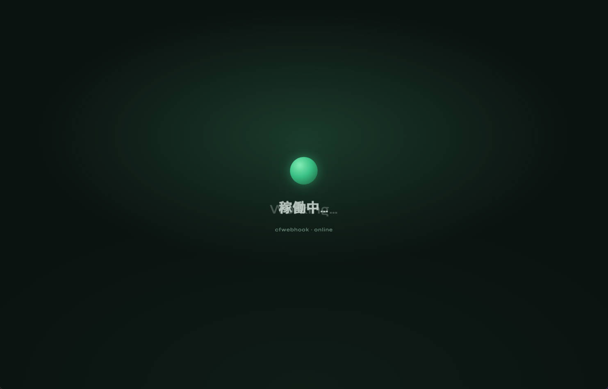

# cfwebhook

<p align="center">
  <a href="#english"></a>
  &nbsp;
  <a href="#中文"></a>
</p>

<p align="center">
  Cloudflare Worker · HTTP Webhook → Telegram<br/>
  <a href="LICENSE"></a>
</p>



---

## English

<p align="right"><a href="#中文">中文 ▸</a></p>

Cloudflare Worker that receives HTTP webhooks and forwards the body to Telegram.

### What it does

| Method | Behavior |
|--------|----------|
| **GET** | Shows a lightweight “running” status page. Click the center orb to open this GitHub repo; click anywhere else to copy the current webhook URL (`location.origin`). |
| **POST** | Treats the request body as the message text and forwards it to Telegram via Bot API `sendMessage`. The body is **not modified**, except an optional timestamp footer. |

Typical flow:

1. A client `POST`s plain text (or any body) to your Worker URL.
2. Optional IP allowlist check.
3. Optional timezone timestamp appended.
4. Message is sent to the configured Telegram chat.
5. Worker returns `Success` or an error response.

### Cloudflare variables

In the Worker dashboard: **Settings → Variables and Secrets**.

| Variable | Required | Description |
|----------|----------|-------------|
| `TELEGRAM_TOKEN` | Yes | Telegram Bot token from [@BotFather](https://t.me/BotFather). |
| `TELEGRAM_ID` | Yes | Target chat / user ID. |
| `WHITE_IP_LIST` | No | Comma-separated IPs. Empty or unset = allow all. Uses `CF-Connecting-IP`. |
| `TIMER_STAMP` | No | IANA timezone, e.g. `Asia/Shanghai`. Empty / invalid / unset = disabled. When enabled, appends: |

```text
—————————
时间: 2026-08-03 02:00
```

`keep_vars` is enabled in `wrangler.jsonc`, so dashboard variables are kept across deploys unless you overwrite them in config.

### Deploy on Cloudflare

1. Create a Worker (or connect this GitHub repo to Workers Builds).
2. Build command: `bun run build` (or `npm run build`).
3. Deploy command: `npx wrangler deploy` (config: `wrangler.jsonc`, entry: `build/index.js`).
4. Set the variables above in the dashboard.
5. Your webhook URL is the Worker route, e.g. `https://<name>.<subdomain>.workers.dev`.

Local:

```bash
bun install
bun run build
bun run deploy   # needs wrangler auth
```

### Send a test message

```bash
curl -X POST "https://YOUR_WORKER_URL" \
  -H "Content-Type: text/plain" \
  -d "hello from cfwebhook"
```

### License

[MIT](LICENSE) © 2026 jack (shengshk)

---

## 中文

<p align="right"><a href="#english">◂ English</a></p>

将 HTTP Webhook 请求体转发到 Telegram 的 Cloudflare Worker。

### 功能说明

| 方法 | 行为 |
|------|------|
| **GET** | 返回轻量「运行中」状态页。点击中心光球打开本 GitHub 仓库；点击页面其他区域复制当前 Webhook 地址（`location.origin`，不硬编码）。 |
| **POST** | 将请求体原文作为消息，通过 Telegram Bot API `sendMessage` 转发。**不改动正文内容**，仅在开启时区时间戳时在末尾追加。 |

典型流程：

1. 客户端向 Worker URL 发送 `POST`（正文任意文本）。
2. 可选：IP 白名单校验。
3. 可选：按配置时区追加时间戳。
4. 发送到配置的 Telegram 会话。
5. 返回 `Success` 或错误信息。

### 在 Cloudflare 页面配置变量

路径：**设置 → 变量和密钥（Variables and Secrets）**。

| 变量 | 必需 | 说明 |
|------|------|------|
| `TELEGRAM_TOKEN` | 是 | Telegram Bot Token（[@BotFather](https://t.me/BotFather)）。 |
| `TELEGRAM_ID` | 是 | 目标聊天 / 用户 ID。 |
| `WHITE_IP_LIST` | 否 | 逗号分隔 IP。留空或不配置 = 不限制。匹配请求头 `CF-Connecting-IP`。 |
| `TIMER_STAMP` | 否 | IANA 时区，如 `Asia/Shanghai`。未配置 / 留空 / 无效 = 不追加时间。开启时在消息末尾追加： |

```text
—————————
时间: 2026-08-03 02:00
```

`wrangler.jsonc` 已开启 `keep_vars`，用 Git 构建部署时一般会保留控制台里已配置的变量。

### 部署

1. 创建 Worker，或将本仓库接入 Cloudflare Workers Builds。
2. 构建命令：`bun run build`（或 `npm run build`）。
3. 部署命令：`npx wrangler deploy`（配置 `wrangler.jsonc`，入口 `build/index.js`）。
4. 在控制台配置上述变量。
5. Webhook 地址即 Worker 访问域名，例如 `https://<name>.<subdomain>.workers.dev`。

本地：

```bash
bun install
bun run build
bun run deploy   # 需先 wrangler 登录
```

### 测试发送

```bash
curl -X POST "https://你的Worker地址" \
  -H "Content-Type: text/plain" \
  -d "来自 cfwebhook 的测试"
```

### 许可证

[MIT](LICENSE) © 2026 jack (shengshk)
